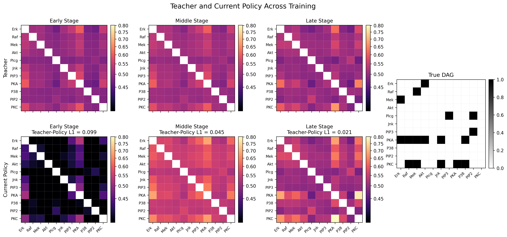
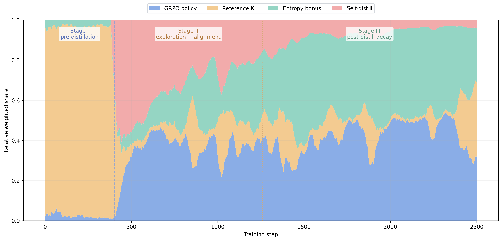

# GRPO-SD rebuttal results

**Table 1: Ablation study of GRPO-SD.** W/O CD: without Causal-FTformer; W/O GRPO: without GRPO; W/O SD: without self-distillation; Fixed-Arch & Hypers: fixed architecture and fixed hyperparameters. Results are reported as mean ± standard deviation over ten runs. Best results are in **bold**.

| Dataset |       Method        |      FDR ↓      |      TPR ↑      |      FPR ↓      |      ACC ↑      |   Precision ↑   |    Recall ↑     |      F1 ↑       |      SHD ↓       |
| ------- | :-----------------: | :-------------: | :-------------: | :-------------: | :-------------: | :-------------: | :-------------: | :-------------: | :--------------: |
| Asia    |       W/O CD        |   0.28 ± 0.30   |   0.38 ± 0.18   |   0.03 ± 0.04   |   0.90 ± 0.05   |   0.72 ± 0.30   |   0.38 ± 0.18   |   0.47 ± 0.20   |   6.60 ± 2.88    |
| Asia    |      W/O GRPO       |   0.26 ± 0.31   |   0.48 ± 0.14   |   0.03 ± 0.04   |   0.91 ± 0.06   |   0.74 ± 0.31   |   0.48 ± 0.14   |   0.57 ± 0.20   |   6.00 ± 3.54    |
| Asia    |       W/O SD        |   0.27 ± 0.22   |   0.35 ± 0.14   |   0.03 ± 0.02   |   0.90 ± 0.03   |   0.73 ± 0.22   |   0.35 ± 0.14   |   0.46 ± 0.15   |   6.40 ± 1.67    |
| Asia    | Fixed-Arch & Hypers |   0.32 ± 0.18   | **0.54 ± 0.06** |   0.05 ± 0.04   |   0.90 ± 0.03   |   0.68 ± 0.18   | **0.54 ± 0.06** |   0.57 ± 0.04   |   6.40 ± 1.90    |
| Asia    |     **GRPO-SD**     | **0.20 ± 0.12** |   0.50 ± 0.00   | **0.02 ± 0.01** | **0.92 ± 0.01** | **0.80 ± 0.12** |   0.50 ± 0.00   | **0.61 ± 0.03** | **5.10 ± 0.74**  |
| Cancer  |       W/O CD        |   0.42 ± 0.09   |   0.45 ± 0.11   |   0.06 ± 0.02   |   0.86 ± 0.02   |   0.58 ± 0.09   |   0.45 ± 0.11   |   0.50 ± 0.09   |   3.50 ± 0.53    |
| Cancer  |      W/O GRPO       |   0.40 ± 0.09   |   0.40 ± 0.13   | **0.05 ± 0.00** |   0.86 ± 0.02   |   0.60 ± 0.09   |   0.40 ± 0.13   |   0.48 ± 0.12   |   3.40 ± 0.52    |
| Cancer  |       W/O SD        |   0.45 ± 0.08   |   0.38 ± 0.13   |   0.06 ± 0.02   |   0.85 ± 0.02   |   0.55 ± 0.08   |   0.38 ± 0.13   |   0.44 ± 0.11   |   3.70 ± 0.48    |
| Cancer  | Fixed-Arch & Hypers |   0.38 ± 0.08   |   0.42 ± 0.12   | **0.05 ± 0.00** |   0.87 ± 0.02   |   0.62 ± 0.08   |   0.42 ± 0.12   |   0.50 ± 0.12   |   3.30 ± 0.48    |
| Cancer  |     **GRPO-SD**     | **0.33 ± 0.00** | **0.50 ± 0.00** | **0.05 ± 0.00** | **0.88 ± 0.00** | **0.67 ± 0.00** | **0.50 ± 0.00** | **0.57 ± 0.00** | **3.00 ± 0.00**  |
| NetSim  |       W/O CD        |   0.60 ± 0.11   |   0.29 ± 0.15   |   0.05 ± 0.01   |   0.88 ± 0.02   |   0.40 ± 0.11   |   0.29 ± 0.15   |   0.28 ± 0.07   |   12.40 ± 1.52   |
| NetSim  |      W/O GRPO       |   0.62 ± 0.14   |   0.25 ± 0.10   |   0.05 ± 0.02   |   0.87 ± 0.02   |   0.38 ± 0.14   |   0.25 ± 0.10   |   0.29 ± 0.12   |   12.80 ± 1.92   |
| NetSim  |       W/O SD        |   0.56 ± 0.04   |   0.44 ± 0.15   |   0.07 ± 0.02   |   0.88 ± 0.01   |   0.44 ± 0.04   |   0.44 ± 0.15   |   0.43 ± 0.09   |   12.20 ± 0.84   |
| NetSim  | Fixed-Arch & Hypers |   0.57 ± 0.13   |   0.27 ± 0.10   | **0.04 ± 0.01** |   0.88 ± 0.02   |   0.43 ± 0.13   |   0.27 ± 0.10   |   0.33 ± 0.11   |   12.00 ± 1.70   |
| NetSim  |     **GRPO-SD**     | **0.49 ± 0.05** | **0.64 ± 0.09** |   0.08 ± 0.02   | **0.89 ± 0.01** | **0.51 ± 0.05** | **0.64 ± 0.09** | **0.56 ± 0.03** | **10.90 ± 0.99** |
| Sachs   |       W/O CD        |   0.28 ± 0.08   |   0.38 ± 0.10   | **0.02 ± 0.01** |   0.89 ± 0.01   |   0.72 ± 0.08   |   0.38 ± 0.10   |   0.49 ± 0.09   |   13.10 ± 1.45   |
| Sachs   |      W/O GRPO       |   0.37 ± 0.06   |   0.50 ± 0.05   |   0.05 ± 0.01   |   0.89 ± 0.01   |   0.63 ± 0.06   |   0.50 ± 0.05   |   0.55 ± 0.05   |   13.55 ± 1.63   |
| Sachs   |       W/O SD        |   0.40 ± 0.14   |   0.38 ± 0.15   |   0.04 ± 0.01   |   0.88 ± 0.02   |   0.60 ± 0.14   |   0.38 ± 0.15   |   0.46 ± 0.15   |   14.67 ± 2.66   |
| Sachs   | Fixed-Arch & Hypers |   0.35 ± 0.23   |   0.35 ± 0.12   |   0.03 ± 0.01   |   0.89 ± 0.02   |   0.65 ± 0.23   |   0.35 ± 0.12   |   0.46 ± 0.15   |   12.20 ± 0.92   |
| Sachs   |     **GRPO-SD**     | **0.24 ± 0.09** | **0.52 ± 0.10** |   0.03 ± 0.02   | **0.91 ± 0.01** | **0.76 ± 0.09** | **0.52 ± 0.10** | **0.61 ± 0.05** | **11.30 ± 0.82** |

**Table 2: Results on the Netsim dataset with NAS applied.** We apply the same NAS strategy to all baselines for a fair comparison. The best result is shown in **bold**. Our method is **GRPO-SD (Ours)**.

| Methods            |          FDR ↓ |          TPR ↑ |          FPR ↓ |          ACC ↑ |    Precision ↑ |       Recall ↑ |           F1 ↑ |           SHD ↓ |
| ------------------ | -------------: | -------------: | -------------: | -------------: | -------------: | -------------: | -------------: | --------------: |
| Notears-NAS (2018) |     0.68(0.14) |     0.16(0.08) |     0.08(0.04) |     0.87(0.02) |     0.32(0.14) |     0.16(0.08) |     0.22(0.11) |     12.90(1.60) |
| GraNDAG-NAS (2019) |     0.63(0.03) |     0.55(0.00) |     0.12(0.02) |     0.85(0.01) |     0.37(0.03) |     0.55(0.00) |     0.44(0.02) |     15.40(1.35) |
| GOLEM-NAS (2020)   |     0.54(0.16) |     0.30(0.11) |     0.04(0.02) |     0.88(0.02) |     0.46(0.16) |     0.30(0.11) |     0.36(0.13) |     11.60(2.41) |
| DiffAN-NAS (2022)  |     0.66(0.06) |     0.67(0.10) |     0.16(0.02) |     0.82(0.03) |     0.34(0.06) |     0.67(0.10) |     0.45(0.08) |     18.10(3.14) |
| CaPS-NAS (2024)    |     0.61(0.03) | **0.73(0.00)** |     0.37(0.05) |     0.84(0.02) |     0.39(0.03) | **0.73(0.00)** |     0.51(0.03) |     15.50(1.58) |
| CORL-NAS (2021)    |     0.61(0.10) |     0.23(0.05) |     0.04(0.01) |     0.88(0.01) |     0.39(0.10) |     0.23(0.05) |     0.29(0.06) |     12.50(1.35) |
| COSMO-NAS (2024)   |     0.55(0.28) |     0.40(0.23) |     0.10(0.06) |     0.84(0.03) |     0.27(0.14) |     0.40(0.23) |     0.32(0.17) |     15.73(3.23) |
| SDCD-NAS (2024)    |     0.64(0.06) |     0.65(0.11) |     0.16(0.01) |     0.82(0.02) |     0.36(0.06) |     0.65(0.11) |     0.46(0.07) |     12.70(1.06) |
| ALIAS-NAS (2025)   |     0.58(0.10) |     0.28(0.10) | **0.05(0.01)** |     0.88(0.01) |     0.42(0.10) |     0.28(0.10) |     0.34(0.10) |     12.00(1.12) |
| ABCNAS-RL (2025)   |     0.52(0.09) |     0.23(0.05) |     0.08(0.02) |     0.86(0.01) |     0.31(0.06) |     0.23(0.05) |     0.26(0.05) |     14.10(0.99) |
| **GRPO-SD (Ours)** | **0.49(0.05)** |     0.64(0.09) |     0.08(0.02) | **0.89(0.01)** | **0.51(0.05)** |     0.64(0.09) | **0.56(0.03)** | **10.90(0.99)** |

**Figure 1:**

Figure 2:

